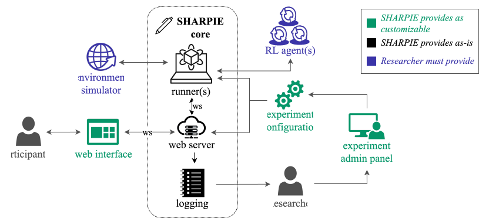
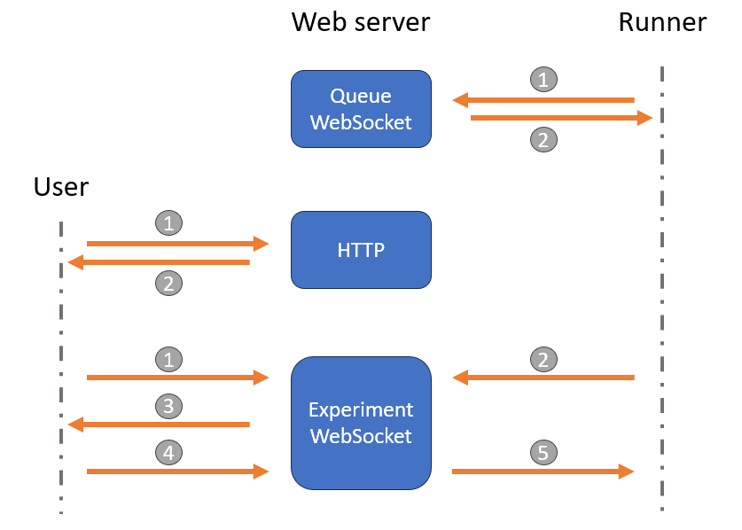

Architecture
============

SHARPIE is organized around three main components: participant-facing web interface, the web server and the runner.

Participant-facing web interface
--------------------------------
| The participant-facing web interface consists of a basic HTML and javascript web pages.
| SHARPIE uses the Django templating system for building these pages.
| You can read more about the Django template system in the `Django documentation <https://docs.djangoproject.com/en/6.0/topics/templates/>`_.

Web server
----------

| The web server serves files to the participants, interacts with the runners, and manages the data.
| The web server is divided in 4 apps:

* **Home**: the landing page of the platform.
* **Admin**: managing the platform settings, users, and experiments.
* **Accounts**: login in and registering users.
* **Experiments**: participant-facing and backend-facing interface to run experiments.

These are implemented using Django, see its `documentation <https://docs.djangoproject.com/en/6.0/intro/tutorial01/>`_ for more details.

Runner
------

| A runner manages environments and simulated agents during execution of experiments.
| It is designed to be modular and extensible, allowing researchers to easily integrate new environments and algorithms by using simple wrappers.
| It is divided in several modules:

* **Manager**: intitializing and running environments and simulated agents.
* **Environment (per experiment)**: environment wrapper, input mapping and termination condition.
* **Agent (per experiment)**: agent(s) wrapper.

Interaction diagram
-------------------

The following diagram illustrates the interaction between the web server, runner and participant during an experiment.

There are 3 main types of interactions:

1. **Runner - Web server**: once the runner is started, it connects to the Queue WebSocket of the web server and polls for new experiments in the queue. When an experiment is available, the web server sends its configuration to the runner, which then disconnects from the Queue WebSocket and connects to the Experiment WebSocket.
2. **User - Web server**: a participant interacts with their web browser using HTTP(s) requests to the web server. Once a participant starts an experiment, the web server sends them a rendered HTML experiment interface and connects them to the Experiment WebSocket. The participant will then wait for the runner to send the first observation.
3. **User - Web server - Runner**: 
    During the experiment, a participant interacts with the web interface, which sends their actions to the web server using the Experiment WebSocket. The web server forwards these actions to the runner, which processes them in the environment and sends back the new observations, rewards, and done flags. In summary, the communication is as follows:
    
    1. Participant connects to the Experiment WebSocket.
    2. Runner connects to the Experiment WebSocket, prepares the environment, simulated agents and sends the rendered observation.
    3. Web server forwards the observation to the participant and logs the interaction in the database.
    4. Participant sends input through the Experiment WebSocket.
    5. Web server forwards the input to the runner which processes it in the environment and sends back the new observation, reward, etc.
    
    Steps 3 to 5 are repeated until the episode is over. The user and runner then disconnect from the Experiment WebSocket, and the runner becomes available again. It will return to polling the Queue WebSocket until a new episode starts.