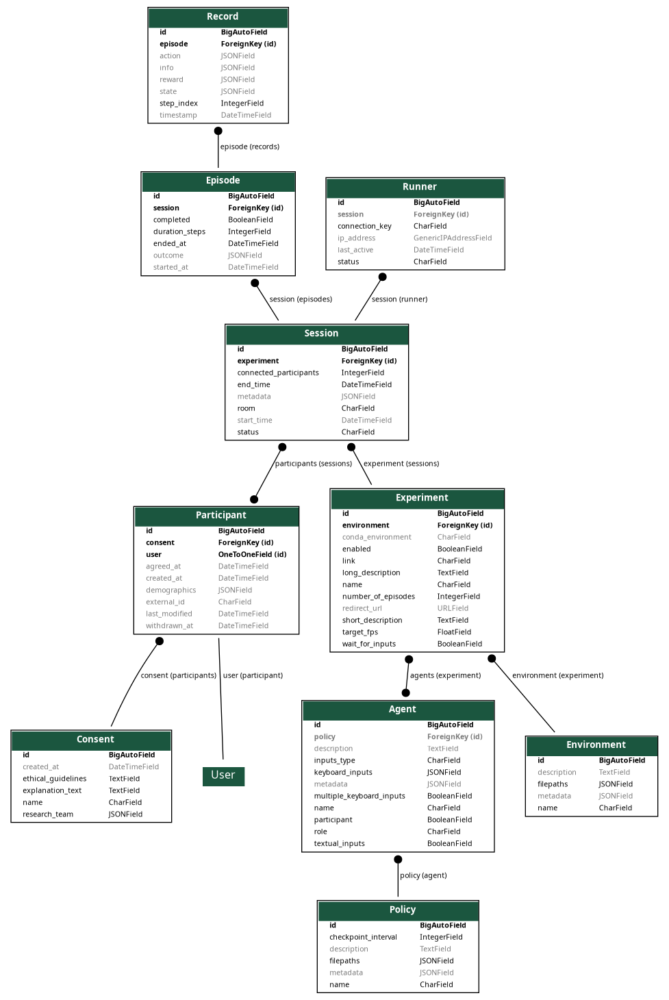

Data Model
==========

The SHARPIE data model is organized into four Django apps, each handling a specific domain of the platform.

Accounts
--------

The accounts app manages user authentication and research consent.

**Consent**
    Stores consent form information for research participation. Includes the consent name, explanation text, research team details, and ethical guidelines. Once created, consent records cannot be modified or deleted to ensure audit trail integrity.

**Participant**
    Represents a study participant. Links to Django's built-in ``User`` model and stores:

    - ``external_id``: External identifier (e.g., from recruitment platforms like Prolific)
    - ``demographics``: Optional demographic information as JSON
    - ``consent``: Reference to the agreed consent form
    - ``agreed_at`` / ``withdrawn_at``: Timestamps for consent agreement and withdrawal

Experiment
----------

The experiment app defines the configuration for RL experiments.

**Environment**
    A simulated Markov decision process (MDP) adhering to the Gymnasium API. Contains:

    - ``filepaths``: Paths to the environment implementation files
    - ``metadata``: Additional configuration as JSON

**Policy**
    An RL policy instance—a mapping from states to actions. Contains:

    - ``filepaths``: Paths to policy implementation files
    - ``checkpoint_interval``: How often to save policy checkpoints

**Agent**
    An entity that perceives and acts in the environment. An agent can be:

    - An AI agent controlled by a ``Policy``
    - A human participant (``participant=True``)
    - A hybrid with both policy and participant control

    Agents define input handling through ``keyboard_inputs`` and ``textual_inputs`` fields.

**Experiment**
    A configured study combining environment, agents, and participants. Key fields:

    - ``link``: Unique URL slug for the experiment
    - ``environment``: The environment to use (ForeignKey)
    - ``agents``: Agents involved in the experiment (ManyToMany)
    - ``number_of_episodes``: Episodes to complete
    - ``target_fps`` / ``wait_for_inputs``: Timing configuration

Data
----

The data app logs all experiment interactions.

**Session**
    A single run of participants through an experiment. Tracks:

    - ``experiment``: Which experiment is being run
    - ``participants``: Who participated (ManyToMany)
    - ``status``: Current state (not_ready, ready, pending, running, completed, aborted)
    - ``start_time`` / ``end_time``: Session duration

**Episode**
    One complete interaction sequence within a session—from initial state to termination.

    - ``session``: Parent session
    - ``duration_steps``: Number of steps in the episode
    - ``outcome``: Final outcome data as JSON

**Record**
    A single step entry capturing the complete state at that moment:

    - ``episode``: Parent episode
    - ``step_index``: Position in the episode
    - ``state``: Environment state
    - ``action``: Actions taken
    - ``reward``: Rewards received
    - ``info``: Additional information from the environment

Runner
------

The runner app manages the execution infrastructure.

**Runner**
    Represents a running instance that connects via WebSocket to execute experiments.

    - ``connection_key``: Unique key for authentication
    - ``status``: Current runner status
    - ``session``: Currently active session (if any)
    - ``ip_address``: Runner's IP address

Entity Relationships
--------------------

The following key relationships connect the models:

``Participant`` → ``User``
    One-to-one relationship with Django's built-in User model.

``Participant`` → ``Consent``
    Many-to-one relationship; multiple participants can agree to the same consent form.

``Agent`` → ``Policy``
    Many-to-one relationship; an agent can optionally be controlled by a policy.

``Experiment`` → ``Environment``
    Each experiment uses exactly one environment.

``Experiment`` ↔ ``Agent``
    Many-to-many relationship; an experiment can have multiple agents.

``Session`` → ``Experiment``
    Each session runs one specific experiment configuration.

``Session`` ↔ ``Participant``
    Many-to-many relationship; a session can have multiple participants.

``Episode`` → ``Session``
    Each episode belongs to exactly one session.

``Record`` → ``Episode``
    Each record belongs to exactly one episode, forming the step-by-step log.

``Runner`` → ``Session``
    A runner can be assigned to one active session at a time.