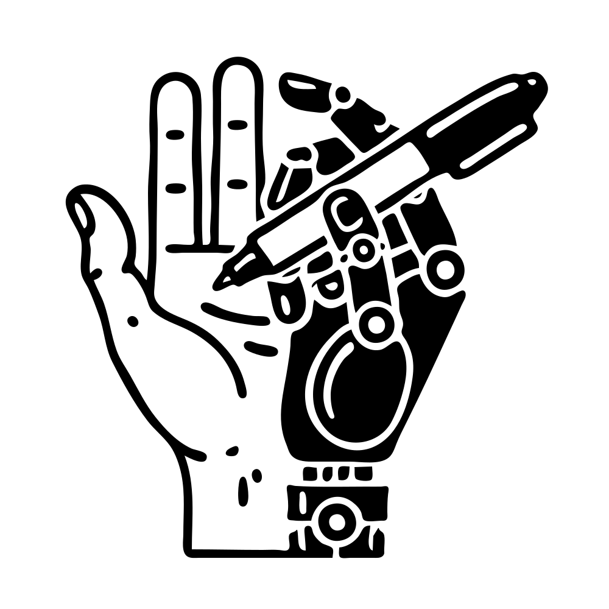

Welcome to SHARPIE's documentation!
===================================

**SHARPIE**, or Shared Human-AI Reinforcement Learning Platform for Interactive Experiments, is a modular framework to conduct experiments involving humans and reinforcement learning agents.

Reinforcement learning offers a general approach for modeling and training AI agents, including human-AI interaction scenarios. SHARPIE addresses the need for a generic framework to support experiments with RL agents and humans. Its modular design consists of a participant-facing web interface, a webserver to synchronize multiple participants and agents interacting with a single environment, and a runner to encapsulate RL environments and algorithm libraries.

SHARPIE comes with logging utilities, supports deployment on popular cloud platforms, and integrates with participant recruitment platforms. 

It empowers researchers to study a wide variety of research questions related to the interaction between humans and RL agents, including those related to interactive reward specification and learning, learning from human feedback, action delegation, preference elicitation, user-modeling, and human-AI teaming. The platform is based on a generic interface for human-RL interactions that aims to standardize the field of study on RL in human contexts.

Check out the :ref:`getting_started_section` section for further information, including
the :doc:`installation` of the project.

.. note::

   This project is under active development.

Contents
--------
.. _getting_started_section:

.. toctree::
   :maxdepth: 2
   :caption: Getting Started

   installation
   quickstart
   hello_world
   architecture
   faq

.. toctree::
   :maxdepth: 2
   :caption: Deep Dive

   customization
   deployment
   crowdworker_integration
   installation_update
   data_model
   dependencies
   glossary

.. toctree:: 
   :maxdepth: 2
   :caption: Development

   development_intro
   contributing
   engineering_principles
   benchmark
   release_checklist

.. toctree::
   :maxdepth: 2
   :caption: API
   
   api

Source code `GitHub <https://github.com/hybrid-intelligence/SHARPIE>`_.